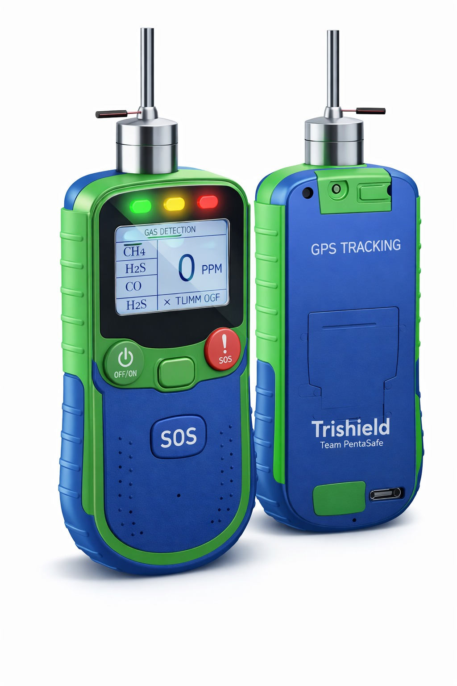

# TriShield
Portable multi-gas detection and emergency alert system for confined-space sanitation worker safety.
## 🚨 Problem Statement
Sanitation workers are exposed to hazardous gases such as Methane (CH4), Hydrogen Sulfide (H2S), and Carbon Monoxide (CO) while working in confined spaces like sewers and manholes. Lack of real-time monitoring leads to severe health risks and fatalities.

---

## 💡 Solution Overview
TriShield is a handheld smart multi-gas detection device that provides real-time monitoring and tri-color alert signals to ensure worker safety before and during sewer entry.

---

## 🔧 Key Features
- Real-time multi-gas detection (CH4, H2S, CO)
- Tri-color safety indicators (Green, Yellow, Red)
- Emergency SOS button
- Trigger activation system
- Rechargeable battery
- GPS tracking (optional)
- Eco-friendly protective mask integration

---

## 🛠 Technologies Used
- Arduino Nano
- MQ-series Gas Sensors
- Embedded C/C++
- GPS Module (Neo-6M)
- GSM Module (Optional)
- Rechargeable Li-ion Battery

---

## 🔄 Working Mechanism
1. Device is powered ON.
2. Gas sensors detect surrounding air quality.
3. Microcontroller processes PPM values.
4. System compares values with safety thresholds.
5. LED and buzzer provide alert signals.
6. SOS button sends emergency signal (if integrated with GSM/GPS).

---

## 🌱 Future Scope
- IoT dashboard integration
- Data logging & analytics
- Health monitoring sensors
- Smart city integration

---

---

## 📸 Project Prototype

---

## 📄 Project Documentation

[Download Project PDF](MITVPU-SAMVED-Idea-Presentation-Template (1) (1).pdf)

## 👥 Team
Team Pandavas  
Civil Engineering & AI/ML Students
